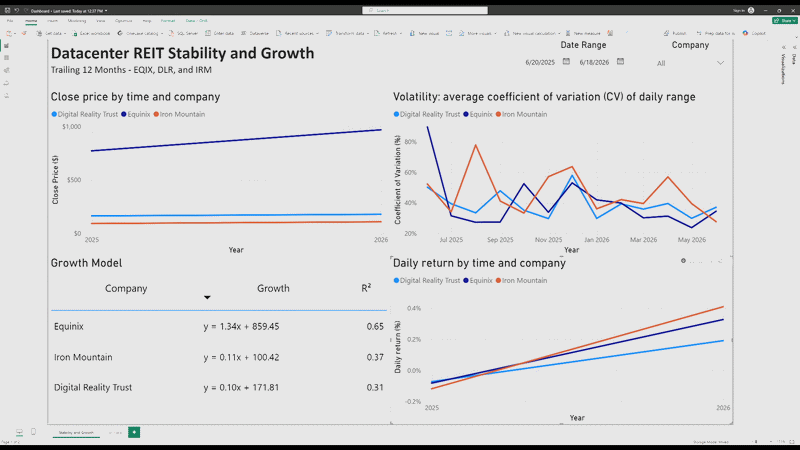
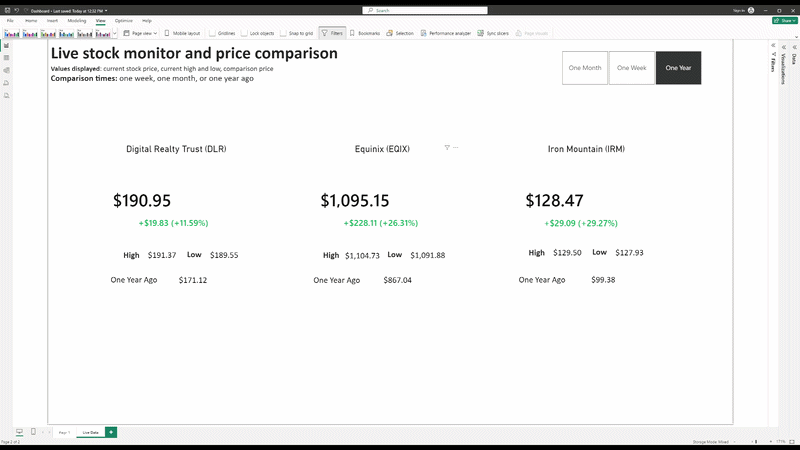
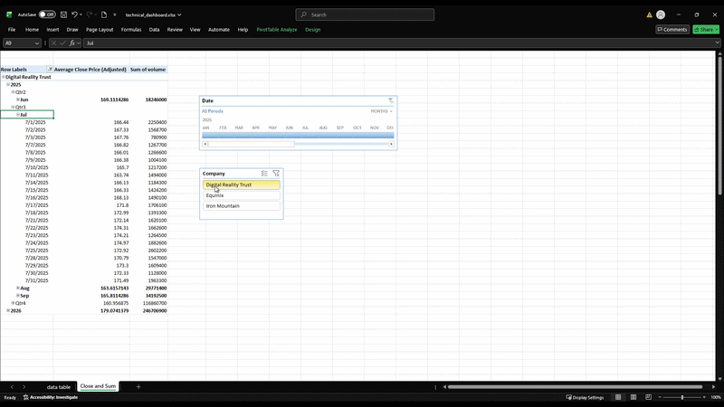

# Datacenter REIT Analysis Pipeline

An end to end data pipeline and business intelligence project analyzing the price stability and growth of three datacenter REITs over a trailing 12 month window: Equinix (EQIX), Digital Realty (DLR), and Iron Mountain (IRM). It covers the full workflow from data ingestion through a relational database to interactive dashboards, plus a separate real time price pipeline.

---

## A note on scope

This is primarily a data engineering and business intelligence project. The focus is on building a working pipeline: extracting data from an API, modeling it in a relational database, transforming it with SQL and Python, and surfacing it through Power BI and Excel. Stock data is the domain, but this is not a rigorous equity analysis. A professional assessing REITs would use measures like beta, Sharpe ratio, drawdown, and benchmark comparison, which are out of scope here and planned for a future project.

---

## Research question

Among Equinix, Digital Realty, and Iron Mountain, which datacenter REIT showed the most stable growth over the trailing 12 months?

Stability is measured using the coefficient of variation (CV) of the daily price range, aggregated monthly. Growth is measured using a per company linear regression of adjusted close on time, reporting the slope (growth rate) and R squared (how linear that growth was).

---

## Dashboard previews

### Retrospective dashboard


### Live monitor dashboard


### Excel pivot dashboard



---
## Written deliverables

Two written reports were produced as part of this project, modeled after the analytical workflow a junior analyst at an investment advisory firm would complete.

- **Full data analysis report** (`Datacenter_REIT_Report.docx`): a structured report following Introduction, Analysis (by metric), Conclusion, and Appendix format, covering company selection rationale, growth, stability, daily return, and the methodological decisions behind the analysis.
- **Committee summary** (`Datacenter_REIT_Committee_Summary.docx`): a one page plain-English summary written for a non-technical investment committee audience, distilling the findings and recommendation from the full report.
  
## Tech stack

- **Python** (pandas, SQLAlchemy, statsmodels, yfinance) for ETL and analysis
- **MySQL** for the relational database
- **Power BI** for the retrospective and live monitoring dashboards
- **Excel** for a pivot table dashboard
- **MariaDB ODBC connector** to enable DirectQuery from Power BI to MySQL
- **Windows Task Scheduler** for daily automation
- **Git / GitHub** for version control

---

## Database design

The database (`datacenter_reits`) uses a star schema with `companies` as the central dimension table and three fact tables linked by a `ticker` foreign key.

- **companies**: static reference table (ticker, company name, sector, exchange)
- **daily_prices**: daily OHLCV data plus daily return, one row per ticker per trading day
- **monthly_summary**: monthly aggregated metrics (mean daily range, standard deviation, CV of daily range, mean close, monthly return)
- **regression_results**: one row per company holding the regression slope, R squared, and intercept
- **live_prices**: current price, today's high, today's low, and a last updated timestamp, one row per ticker, overwritten in place

---

## Project components

### 1. ETL pipeline
A Python pipeline pulls a trailing 12 month window of daily OHLCV data for all three tickers via yfinance, reshapes the multi index output into a row per ticker per day, calculates daily return, and loads the result into MySQL. The companies table is seeded once with a guard that prevents duplicate inserts on repeat runs.

### 2. Analysis
A separate notebook runs a per company linear regression of adjusted close on a centered time variable using statsmodels, then writes the slope, R squared, and intercept to the `regression_results` table. Centering the time variable makes the intercept interpretable as the mean adjusted close over the period. Inferential tests (Kruskal-Wallis, Dunn's) were explored but excluded because daily stock prices are autocorrelated, which violates the independence assumption those tests rely on. See `METHODOLOGY.md` for the full reasoning.

### 3. SQL
The `sql` folder contains the schema setup and a set of analytical queries demonstrating multi table JOINs (INNER, LEFT, RIGHT), window functions (FIRST_VALUE, LAST_VALUE), and chained CTEs used to build the monthly summary metrics.

### 4. Power BI dashboards
- **Retrospective page**: price trend, volatility (CV) over time, a regression equation table, and a daily return chart, with company and date range slicers and drill down across year, quarter, month, and day.
- **Live monitor page**: current price per company with the dollar and percentage change against a selectable comparison period (1 week, 1 month, 1 year), today's high and low, and conditional formatting that colors the change green or red. This page connects to `live_prices` via DirectQuery using the MariaDB connector, since Power BI does not natively support DirectQuery for MySQL.

### 5. Excel dashboard
A pivot table connected to MySQL through the data model, showing average adjusted close and total volume drillable by company, year, quarter, month, and day, with company and date slicers.

### 6. Real time price pipeline
A standalone Python script connects to yfinance's AsyncWebSocket to stream live prices and writes the current price to `live_prices` on each message. A second concurrent task, running on a 10 minute timer via asyncio, pulls the day's high and low separately. The two writes are independent so each updates on its own rhythm. The original plan was to surface this through a Power BI streaming semantic model via the Push API, but that requires a Power BI Service account tied to a university license that is no longer available post graduation, so the standalone script with DirectQuery refresh is the workaround.

### 7. Automation
The ingestion pipeline was exported to a standalone script and scheduled with Windows Task Scheduler to run daily after market close. The script is idempotent: the companies insert is guarded against duplicates, and daily_prices is truncated and reloaded each run, so the table always reflects the current trailing 12 months without accumulating duplicates.

---

## How to run

1. Install MySQL and create the database by running `sql/setup.sql`.
2. Create a `.env` file in the project root with your MySQL credentials:
   ```
   MYSQL_HOST=localhost
   MYSQL_USER=your_user
   MYSQL_PASSWORD=your_password
   MYSQL_DATABASE=datacenter_reits
   ```
3. Install the Python dependencies `pip install -r requirements.txt`
4. run `python run.py`

---

## Known limitations and caveats

- **Data window.** The dataset reflects a rolling trailing 12 months. Because of when the data was first pulled, the history starts in mid June 2025, so the earliest month has fewer trading days than a full month.
- **Autocorrelation.** Daily stock prices are not independent observations, so the regression slope and R squared are treated as descriptive only, with no p-values reported or interpreted. This is documented in `METHODOLOGY.md`.

---

## Future work

- Migrate the pipeline to a cloud database (AWS RDS or Azure SQL) for cloud experience.
- Apply ARIMA based time series forecasting, which properly accounts for the autocorrelation identified here.
- Redo the analysis with proper financial measures (beta, Sharpe ratio, drawdown, benchmark comparison).

---

## Documentation

- `METHODOLOGY.md`: the reasoning behind the operationalization of stability and growth, and the decision to exclude inferential statistics.
- `PROJECT_CHANGES_LOG.md`: a running record of the major decisions and pivots made throughout the project.
